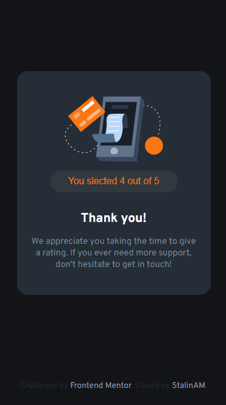

# InteratingRatingComponent

This is a solution to the [Interactive rating component challenge on Frontend Mentor](https://www.frontendmentor.io/challenges/interactive-rating-component-koxpeBUmI). Frontend Mentor challenges help you improve your coding skills by building realistic projects. 

## Table of contents

- [InteratingRatingComponent](#interatingratingcomponent)
  - [Table of contents](#table-of-contents)
    - [Screenshot](#screenshot)
    - [Links](#links)
  - [My process](#my-process)
    - [Built with](#built-with)
    - [What I learned](#what-i-learned)
  - [Author](#author)

### Screenshot




### Links

- Solution URL: [GitHub](https://github.com/StalinAM/InteratingRatingComponent.git)
- Live Site URL: [StalinAM](https://stalinam.github.io/InteratingRatingComponent/)

## My process

### Built with

- Semantic HTML5 markup
- CSS custom properties
- CSS Grid
- JavaScript
- Mobile-first workflow
- Responsive web design

### What I learned

Hide an element with JavaScript.

```html
<div id="main-screen" style="display: flex;"></div>

<div id="secondary-screen" style="display: none;"></div>
```
```js
const primaryScreen = document.getElementById('main-screen');
const secondaryScreen = document.getElementById('secondary-screen');

primaryScreen.style.display = "none";
secondaryScreen.style.display = "flex"
```

Use hover to make it change color when the mouse is hovered over it.

```html
<ul class="option-container">
    <input type="button" value="1">
    <input type="button" value="2">
    <input type="button" value="3">
    <input type="button" value="4">
    <input type="button" value="5">
</ul>

<input id="primary-button" type="submit" value="SUBMIT">
```

```css
.option-container input:hover {
    transition: 1s;
    background-color: var(--Orange);
    font-weight: bold;
    color: var(--White);
}

#primary-button:hover {
    transition: 0.4s;
    background-color: var(--White);
    font-weight: bold;
    color: var(--Orange);
}
```

Use of focus for color change when clicking on entries.

```css
.option-container input:focus {
    background-color: var(--Light-Grey);
    font-weight: bold;
    color: var(--White);
}
```

## Author

- GitHub - [StalinAM](https://github.com/StalinAM)
- Frontend Mentor - [@StalinAM](https://www.frontendmentor.io/profile/StalinAM)